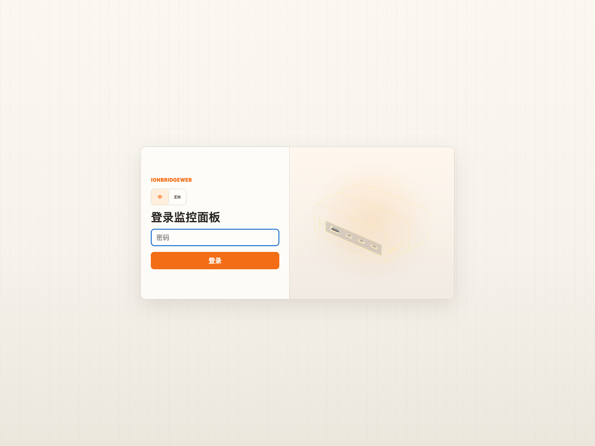
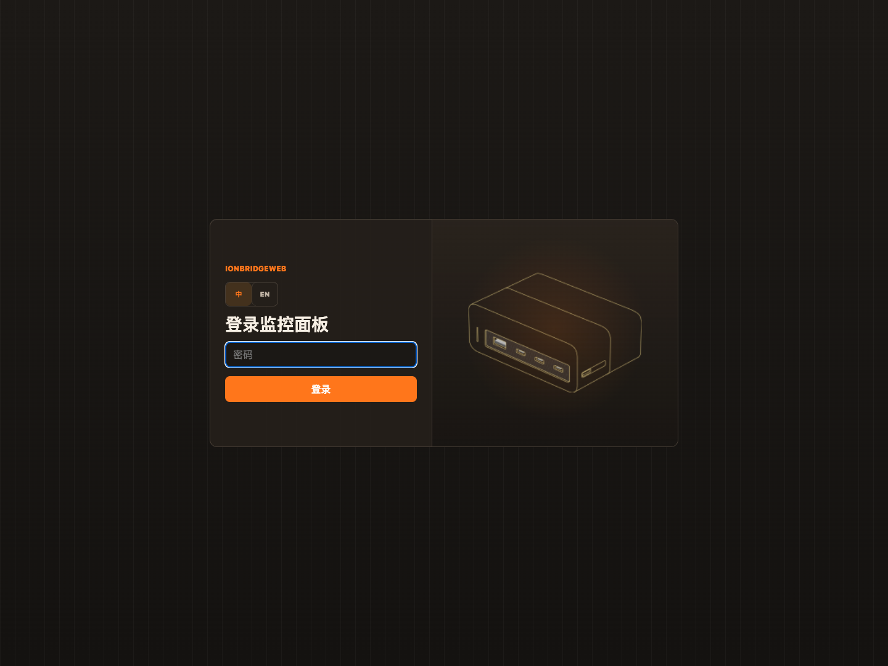
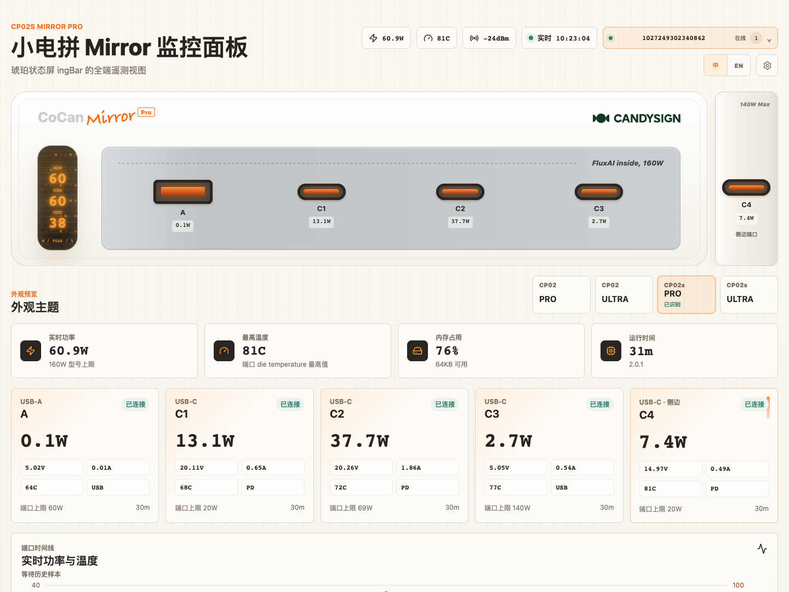
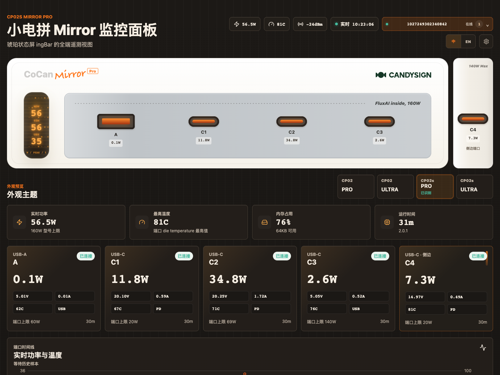
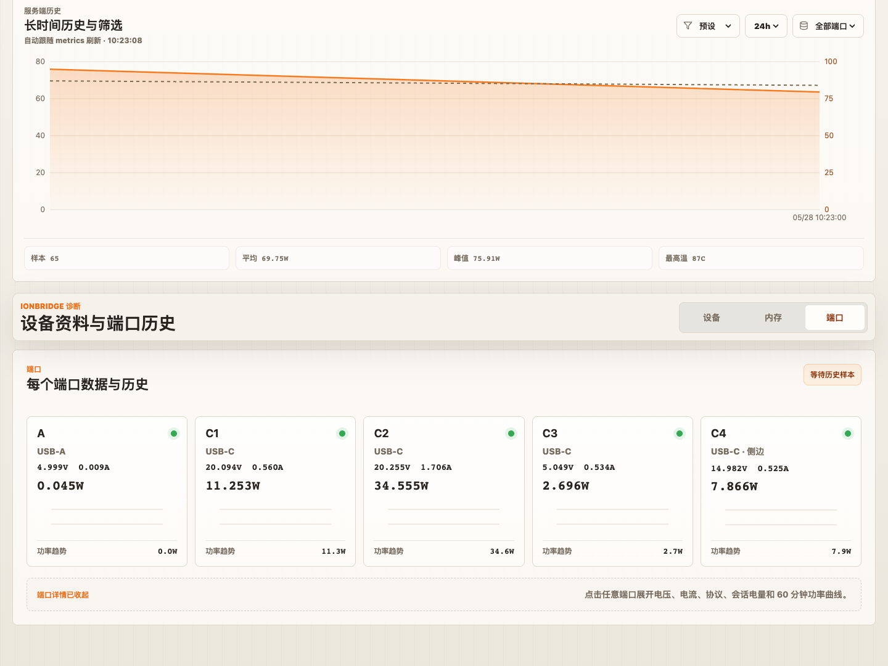
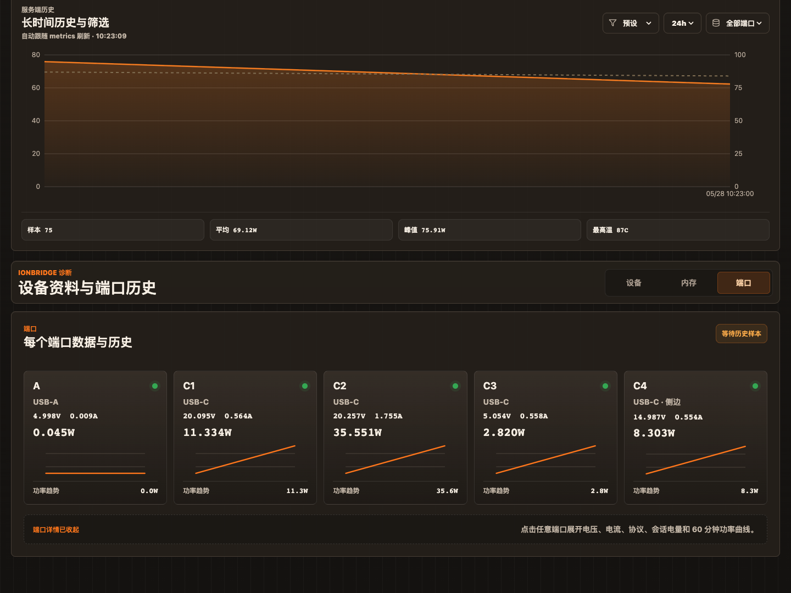
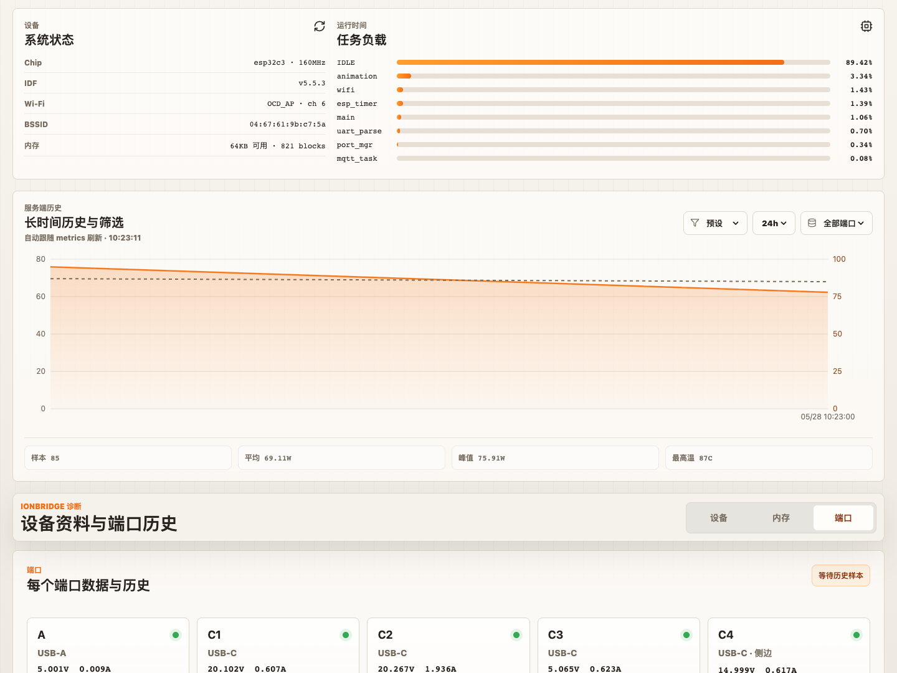
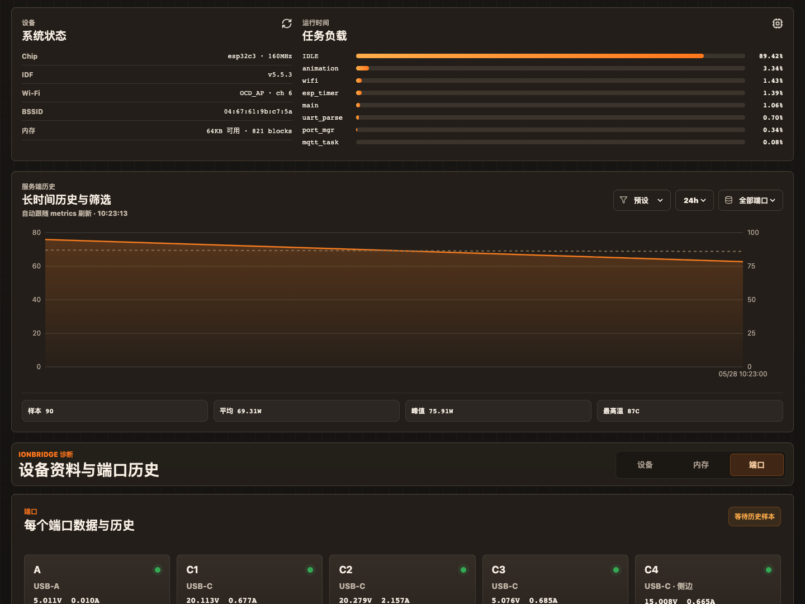
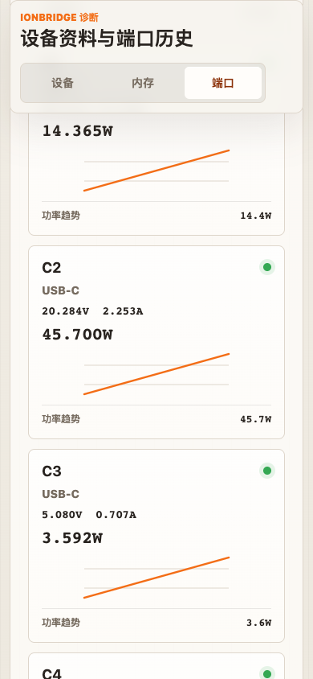
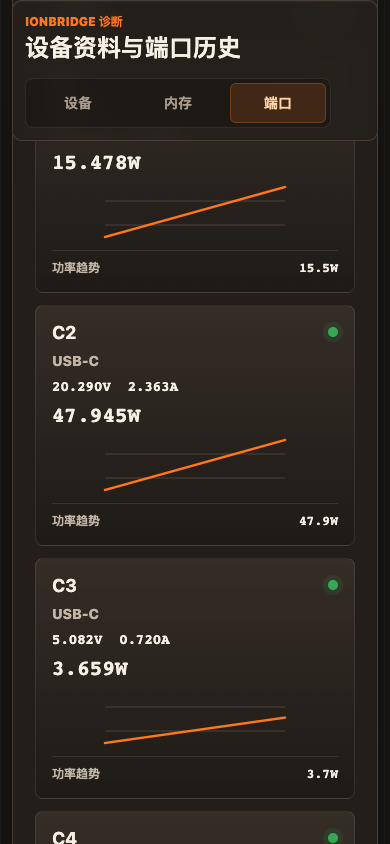

# IonBridgeWeb

小电拼 CP02 / CP02s 的独立前端监控面板。面板读取设备自带 Web Server 的 `/metrics.json`、`/porthistoryz`、`/heapz` 和首页 `window.__INFOZ`，提供实时功率、端口状态、历史曲线、任务负载、内存状态和产品外观主题预览。

界面内置中文和英文，语言选择会保存在浏览器本地。

## 界面预览

截图使用 CP02s 示例数据，仅作参考。

### 登录页

| 普通模式 | 深色模式 |
| --- | --- |
|  |  |

### 监控总览

| 普通模式 | 深色模式 |
| --- | --- |
|  |  |

### 端口数据与历史

| 普通模式 | 深色模式 |
| --- | --- |
|  |  |

### 长时间历史与筛选

| 普通模式 | 深色模式 |
| --- | --- |
|  |  |

### 移动端端口视图

| 普通模式 | 深色模式 |
| --- | --- |
|  |  |

## 启动

```bash
npm install
npm run dev
```

默认开发服务地址为 `http://localhost:5174/`。如果端口被占用，Vite 会提示实际端口。

生产构建：

```bash
npm run build
```

本地预览构建结果：

```bash
npm run preview
```

生产服务模式：

```bash
npm run build
npm run start
```

默认监听 `http://localhost:18318/`。

## Docker 部署

推荐用 Docker 部署，这样可以启用服务端目标配置、密码登录和更长时间的历史采集。

```bash
docker compose up -d --build
```

默认访问地址：

```text
http://localhost:18318/
```

`docker-compose.yml` 中常用环境变量：

```yaml
environment:
  IONBRIDGE_RETENTION_DAYS: "30"
  IONBRIDGE_PASSWORD: "change-me"
volumes:
  - ./data:/data
```

- `IONBRIDGE_RETENTION_DAYS`: 服务端历史保留天数，默认 30 天。
- `IONBRIDGE_PASSWORD`: 设置后启用登录保护；不设置则不要求登录。
- `/data`: 持久化配置和历史数据。

设备地址和采集频率不再通过环境变量配置。首次进入页面后，在设备设置里添加设备；服务端必须成功连接目标首页并解析到 `window.__INFOZ.psn` 后才会保存。拿不到 PSN 的地址不会写入 SQLite。

容器内会保存：

```text
/data/ionbridge.db
```

历史数据写入 SQLite。PSN 是唯一设备标识；IP 或 mDNS 只作为当前连接地址保存，不会作为设备键。服务启动时会按当前 `IONBRIDGE_RETENTION_DAYS` 立即清理超出保留期的数据，之后后台也会周期清理。

## 设备地址

右上角齿轮按钮会展开设备设置，可以配置设备目标地址，例如：

```text
http://192.168.217.161
192.168.217.161
cp02s-1027249302340842.local
```

不带协议时会自动补成 `http://`。点击 `保存配置` 后，服务端会等待目标连接完成并读取 PSN。只有成功拿到 PSN 后，目标才会成为已保存设备；失败时按钮会恢复可点击，并显示错误。

开发模式下：

- 默认地址 `http://192.168.217.161` 走 Vite `/device` 代理。
- 其他地址走动态 `/device-proxy?target=...` 代理。

Docker/生产服务模式下，所有已保存设备都会被后台同时采集。页面顶部会显示已保存设备下拉列表，可以点击切换当前查看设备，也可以移除设备。移除设备会按 PSN 删除该设备和对应历史样本。

目标当前连不上但 SQLite 里已有历史样本时，页面仍会进入监控面板，实时状态显示为 `离线`，历史图表和长时间筛选继续可用。只有当前地址既连不上、又没有任何历史样本时，才会进入目标地址配置页。

## 刷新频率

设备设置里的数字输入框是当前设备的 metrics 获取频率，单位为秒。默认是 `30s`，允许范围是 `1s` 到 `60s`。目标连接成功并拿到 PSN 后立即生效。

Docker/生产服务模式下，这个频率会按 PSN 写入 `targets.refresh_interval_ms`，每台已保存设备可以有独立采集频率，并用于对应目标的服务端后台采集器。

如果请求失败，前端会对当前请求做多次递增间隔重试；本轮最终失败后会进入目标地址配置页，避免用 mock 数据误导用户。修改地址或点击重试后会继续尝试连接目标设备。

## 历史数据

设备的 `/porthistoryz` 通常提供电压和电流历史。前端会把实时 `/metrics.json` 采样补进本地 60 分钟滚动缓存，用于补足历史曲线和温度曲线。

浏览器 60 分钟历史缓存按设备目标地址隔离。生产服务的长期历史按 PSN 归档。

Docker/生产服务模式下，服务端会长期采集 `/metrics.json` 并写入 SQLite。每条样本包含：

- `ts`: 时间戳
- `target`: 设备地址
- `port`: 端口编号
- `voltage` / `current`
- `temperature_c`
- `power_w`
- `attached`
- `protocol`

历史查询接口：

```text
GET /api/history?target=http://192.168.217.161&hours=24
GET /api/history?target=http://192.168.217.161&hours=168&port=3
GET /api/history?target=http://192.168.217.161&start=1779860000000&end=1779863600000
```

`hours` 支持 1 小时到 30 天。`start` / `end` 支持毫秒时间戳自定义范围。`port` 可选，用于筛选单个端口。

页面里的「长时间历史与筛选」会读取这个接口，支持：

- 1h / 6h / 24h / 7d / 30d 时间窗口。
- 自定义开始和结束时间。
- 全部端口或单端口筛选。
- 功率曲线和温度曲线同屏对比。
- 样本数、平均功率、峰值功率和最高温度统计。
- 跟随页面 metrics 刷新自动重拉当前筛选范围。

长历史由服务端后台采集 `/metrics.json` 生成；开发模式下如果没有运行生产服务，这个面板会显示不可用，但「实时功率与温度」仍使用设备 `/porthistoryz` 和浏览器 60 分钟滚动缓存。

数据库文件为 `/data/ionbridge.db`。服务端会自动创建 `targets`、`samples` 和 `settings` 表，并维护 `device_key + ts`、`device_key + port + ts` 索引。`targets.refresh_interval_ms` 按 PSN 保存每台设备的采集频率；`settings` 只保存当前选中的 `active_device_key` 这类全局状态。`device_key` 只使用设备首页 `window.__INFOZ.psn`，没有 PSN 的目标不会保存，也不会写入历史样本。

## 登录

设置 `IONBRIDGE_PASSWORD` 后，API、代理和历史接口会要求登录。登录会写入 HttpOnly Cookie；退出浏览器或重启服务后需要重新登录。

不设置 `IONBRIDGE_PASSWORD` 时面板无需登录，适合只在内网使用。

## 温度说明

当前数据结构里温度来自 `metrics.ports[].die_temperature`，也就是每个端口独立的 die temperature。页面顶部和 `最高温度` 显示所有端口中的最高温度。

因此，同一时刻不同端口温度不同是正常的。当前接口里没有单独的整机温度字段；如果固件后续暴露全局温度，可以在面板里单独接入。

## 外观主题

面板内置四个外观主题：

- CP02 Pro
- CP02 Ultra
- CP02s Pro
- CP02s Ultra

切换外观主题只影响产品视觉预览，不会写入设备。切换设备地址后，外观主题会回到设备信息推断出的默认主题。
